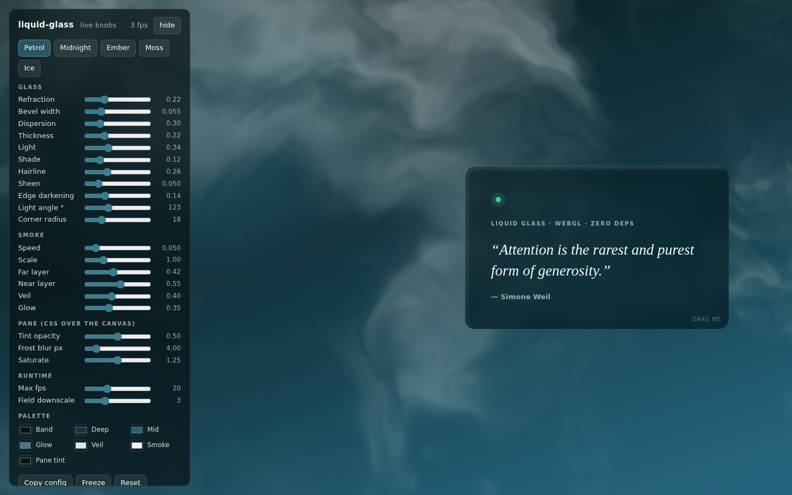

# liquid-glass

**Liquid glass effect for the web** — a zero-dependency WebGL backdrop: slow white smoke drifts through a
dark colour field while a thick, bevelled glass slab **refracts** it under any element you hand it.
Glassmorphism done in a shader rather than a blur: real refraction, chromatic dispersion, a lit bevel,
thickness — and every number is a live knob.

Works with plain HTML, React, Vue, Svelte, Next.js, Astro — it is one ES module and a `<canvas>`.



**▶ [Live demo with knobs](https://mreza0100.github.io/liquid-glass/)** — turn the sliders, drag the pane,
hit *Copy config*, paste the result into your project. (Locally: `npm run demo` → http://localhost:8791/.)

## Why

`backdrop-filter: blur()` gives you frost — a flat, smeared pane. Real glass bends what is behind it:
the image pulls toward the centre, squeezes back out through the bevel, splits into colour at the rim,
catches the light on the edge facing it. Doing that needs a shader, and doing it well needs a background
worth bending — so this ships both: the drifting smoke field **and** the glass, wired to the element you
already have. No Three.js, no build step, no assets.

## What you get

- `liquid-glass.js` — an ES module exporting `LiquidGlass`, `DEFAULTS`, `SHADERS`, `hexToRgb01`. No build step, no framework.
- `index.html` — the demo with live in-place customization: presets, sliders for every parameter, colour
  swatches, a draggable pane the slab follows, an fps readout, and a **Copy config** button that emits the
  exact `new LiquidGlass(...)` call plus the CSS for the pane.

## 30-second use

```html
<canvas id="bg" style="position:fixed; inset:0; width:100%; height:100%"></canvas>
<section class="pane">…your content…</section>

<script type="module">
  import { LiquidGlass } from './liquid-glass.js';

  const pane = document.querySelector('.pane');
  const glass = new LiquidGlass(document.querySelector('#bg'), {
    lens: pane,                                   // the slab tracks this element every frame
    onUnavailable: () => pane.classList.add('flat'), // no WebGL → put your flat background back
  });
</script>
```

```css
/* The DOM element over the canvas carries the tint and the frost — the shader carries the depth. */
.pane {
  background: rgb(7 20 23 / 0.5);
  backdrop-filter: blur(4px) saturate(1.25);
  border-radius: 18px;               /* keep equal to options.radius */
}
.pane.flat { background: linear-gradient(160deg, #071417, #24647A); backdrop-filter: none; }
```

The canvas is sized by **your** CSS; the runtime only sets its pixel buffer (device-pixel-ratio aware,
capped at `maxDpr`).

### React

```jsx
useEffect(() => {
  const glass = new LiquidGlass(canvasRef.current, {
    lens: paneRef.current,
    onUnavailable: () => setFlat(true),
  });
  return () => glass.destroy();
}, []);
```

## API

```js
const glass = new LiquidGlass(canvas, options);
glass.set({ lensStrength: 0.4, palette: { smoke: '#FFF4E8' } }); // live, merges, returns this
glass.setLens(elementOrRectOrNull);
glass.pause(); glass.resume();   // freeze the drift; resume continues without a jump
glass.destroy();                 // releases every GL object and listener
glass.available;                 // false once WebGL is gone (onUnavailable has fired)
glass.frames;                    // frames rendered — sample once a second for fps
LiquidGlass.isSupported();       // can this browser hand out a WebGL context?
```

### Options (all live via `set`)

| key | default | what it does |
| --- | --- | --- |
| `lens` | `null` | An element (tracked per frame), a `{x,y,width,height}` rect in CSS px relative to the canvas, or `null` (field only) |
| `onUnavailable` | `null` | Called once with the error when WebGL is missing, fails to build, or is lost |
| `palette.band / deep / mid` | `#071417 / #123642 / #24647A` | The ground: darkest top-left → lightest bottom-right |
| `palette.rise` | `#3C7C8F` | One slow glow |
| `palette.veil` | `#DCE9ED` | Colour the far smoke is veiled with |
| `palette.smoke` | `#EEF5F3` | Colour the smoke is lit with |
| `smokeSpeed` | `0.05` | Field-time per second (~7 px/s rise on 1440 px). `0` = still |
| `smokeScale` | `1.0` | Spatial scale — higher = finer wisps |
| `smokeFar` / `smokeNear` | `0.42` / `0.55` | Weights of the far (broad, dim) and near (fine, bright) layers; the parallax between them is most of the depth |
| `veilAmount` | `0.40` | How much the far layer is veiled toward `palette.veil` |
| `glow` | `0.35` | Weight of the drifting glow |
| `lensStrength` | `0.22` | Centre-pull refraction — how far the field is magnified through the slab |
| `bevel` | `0.055` | Bevel width as a fraction of the slab's short half-size |
| `dispersion` | `0.3` | R/B chromatic split in the bevel |
| `thickness` | `0.22` | Weight of the fainter far-face image |
| `light` / `shade` | `0.34` / `0.12` | Bevel brightening toward the light / darkening away from it |
| `hairline` | `0.26` | The 2 px rim highlight |
| `sheen` | `0.05` | Soft gradient down the pane |
| `edgeDark` | `0.14` | Interior darkening toward the edges |
| `radius` | `0` | Corner radius in CSS px — match the element's `border-radius` |
| `lightAngle` | `123` | Degrees: 0 = light from the right, 90 = from the top, 123 ≈ top-left |
| `maxFps` | `20` | Frame cap. Smoke this slow needs no more |
| `fieldDownscale` | `3` | The field renders at 1/N canvas resolution — soft by design, cheap to paint |
| `maxDpr` | `2` | Device-pixel-ratio cap |
| `respectReducedMotion` | `true` | Under `prefers-reduced-motion: reduce`: one still frame, redrawn on resize / `set` |

## How it works

Two passes. **Pass 1** paints the field into a small texture: a three-stop ground, one drifting glow, and
two layers of domain-warped 5-octave value-noise fbm smoke (a far layer, broad and dim; a near layer,
finer and brighter, drifting faster). **Pass 2** draws the field to the screen and, inside the lens's
rounded-rect SDF, re-samples it as glass: centre-pull magnification, an outward squeeze through the
bevel, per-channel offsets in the bevel (dispersion), a fainter far-face image mixed in (thickness),
directional light on the bevel, a hairline at the rim, a sheen, and darkening toward the edges. Tint and
frost are deliberately **not** in the shader — the DOM element above the canvas carries them with plain
CSS, so your text sits on a normal element.

## Behaviour you can rely on

- Frame-capped (`maxFps`), pauses while the tab is hidden or the window is unfocused.
- `prefers-reduced-motion: reduce` → a single still frame, no loop.
- WebGL missing / shader build failure / context lost → logged with the error, `onUnavailable(err)` fired
  once, canvas left blank. **Always** give the pane a flat fallback background for that path.
- Palette colours are validated where they enter (`#rrggbb`), so a typo throws at `set()` instead of
  rendering black.

## Browser support

WebGL 1 — every current browser, desktop and mobile. Where it is missing the fallback contract above runs
and your flat background shows; nothing breaks.

## Keywords

liquid glass · glassmorphism · WebGL background · GLSL shader · refraction · chromatic dispersion ·
frosted glass · smoke animation · animated background · backdrop effect · vanilla JS · React

## Licence

MIT — see [LICENSE](LICENSE).
